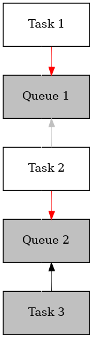

## Pipeline executor

This library allows for simple, dynamic generation of a high throughput sequential data processing pipeline in python.

While not all high throughput data processing can be described by sequential data pipelines, when it can be, this library enables clean, reliabile, testable, and performant code built on top of, simple, pythonic unit testable iterator based compute units.

### Example

(see `examples/pytorch_batcher.py`) for the complete example. You can run this example by installing the dev dependencies with `pip install ".[dev]"` then running `python -m examples.pytorch_batcher`.

```python
# imports ...
from pipeline_executor import execute, PipelineTask

"""
Each part of the pipeline are python generators,
easily unit testable in isolation;
no multithreading or multiprocessing is necessary in each step
"""
def run_model(img_data: Iterable[np.array], model_source: str, model_name: str)->Iterable[np.ndarray]:
    model = torch.hub.load(model_source, model_name)
    for img in img_data:
        results = model(img)
        yield results


def load_images(imgs: List[str])->Iterable[np.ndarray]:
    for img in imgs:
        with urllib.request.urlopen(img) as response:
            img_bytes = response.read()
            img_pil = Image.open(img_bytes, formats=["JPEG"])
            img_numpy = np.array(img_pil)
            yield img_numpy


def remap_results(model_results: Iterable[np.array], classmap: Dict[int, str])->Iterable[Tuple[str, float]]:
    for result in model_results:
        result_class_idx = np.argmax(result)
        result_confidence = result[result_class]
        result_class = classmap[result_class_idx]
        yield (result_class, result_confidence)


def aggregate_results(classes: Iterable[Tuple[str, float]])->None:
    results = list(classes)
    class_stats = Counter(clas for clas, conf in results)
    print(class_stats)

"""
The system details of the pipeline (number of processes, max buffer size, etc)
are defined in a list of simple PipelineTask objects, then executed.

Note that in theory, this list of PipelineTask can be built dynamically,
allowing for various sorts of encapsulation to be built around this library.
"""
def main():
    imgs = [
        'https://ultralytics.com/images/zidane.jpg',
        'https://ultralytics.com/images/zidane.jpg',
        'https://ultralytics.com/images/zidane.jpg'
    ]
    execute(tasks=[
        PipelineTask(
            load_images,
            constants={
                "imgs": imgs,
            },
            packets_in_flight=2,
        ),
        PipelineTask(
            run_model,
            constants={
                "model_name": 'yolov5s', # or yolov5n - yolov5x6, custom
                "model_source": 'ultralytics/yolov5',
            },
            packets_in_flight=4,
            num_workers=2,
        ),
        PipelineTask(
            remap_results,
            constants={
                "classmap": {
                    0: "cat",
                    1: "dog",
                }
            }
        ),
        PipelineTask(
            aggregate_results
        )
    ])


```

### Compute model

A Pipeline has three parts:

1. A *source* generator, outputting a stream of work items
2. *Processor* generators, consuming a linear stream of inputs and producing stream of outputs. These streams do not have to be one-to-one. If the inputs and outputs can be handled independently (user responsible for verifying this), then these processors can be multiplexed across parallel threads.
3. A *sink*: a function that consumes an iterator, returns None

The runtime execution model has a few key concepts:

1. Max Packets in Flight: Max number of total packets being constructed or being consumed. A "packet" is assumped to be under construction whenever a producer or a consumer worker is running. So `packets_in_flight=1` means that the work on the data is completed fully synchronously. If the number of packets is greater than the number of workers, they are stored FIFO queue buffer. See [synchronous processing section below](#synchronous-processing) for more details.
1. Workers: A worker is an independent thread of execution working in an instance of a generator. More than one worker can potentially lead to greater throughput, depending on the implementation.
1. Buffer size (*multiprocessing only*): If `max_message_size` is set, then uses a shared memory scheme to pass data between producer and consumer very efficiently (see benchmark results below). **Warning**: If the actual pickled size of the data exceeds the specified size, then an error is raised, and there is no performance cost to the buffer being too large, so having large buffers is encouraged. If the `max_message_size` is not set, then it uses a pipe to communicate arbitrary amounts of data.

#### Synchronous processing

A unique feature of the pipeline lib is *synchronous processing*, an odd feature in a parallel pipeline, but one designed to minimize the amount of total work being handled by a single executor. This is built for distributed data processing systems where each worker is consuming from a shared pool of work, and should not reserve too much work for itself that it cannot process quickly.

This tradeoff between synchronous vs asynchronous control, in other words, the tradeoff between latency vs bandwidth of pipeline message processing is controlled by a single parameter `packets_in_flight`. From a consumer's perspective, the `packets_in_flight` is an ordinary queue buffer size. If there are avaliable packets that a producer has placed in the buffer, then the consumer can consume them. For example, see the following diagram, which is limited by producer capacity.


From the producer side, however, it is quite different than a queue, in that the system will not yield control back to the worker until there are empty slots avaliable to start producing. See diagram below of system which is limited by consumer capacity. The producers are blocking because all 7 slots are filled, with 5 messages stored in the buffer, waiting to be consumed, and 2 of which are being processed by consumers.


Note the effect of having a series of tasks with `packets_in_flight=1` means that multiple steps execute sequentially. For example, in the below diagram, task 1 is being blocked on the single packet in queue 1 being released, as that is being held by task 2. However, task 2 is in turn being blocked by task 3. Note that even though task 2 is blocked, it still reserving the space on queue 1.




The system enforces this by not yielding control back to the producer until there is a slot avaliable

```python
def generator():
    ...
    # will block until there is space avaliable
    # to produce the next message
    yield message
    ...
```

### Runtime error handling behavior

The following rules for handling errors are tested.

1. If any task exits with *either* and exception *or* a non-zero process exit code, then no more packets will be passed, the whole pipeline will be asked to finish working on its packet for at least 15 seconds, and then be forcefully terminated. The first exception raised, or the first non-zero exit code encountered, will be raised as an exception from the `execute` call.

### Type checking

This library enforces strict type hint checking at pipeline build time through runtime type annotation introspection. So similarly to pydantic or cattrs, it will validate your pipeline based on whether the input of a processor (the first argument) in the pipeline matches the type of the output of the processor before it. Rules include:

1. First argument of any processor or sink must be an `Iterable[<some_type>]` where that type matches the return type of the previous function
1. Any source or processor function must return an `Iterable[<some_type>]`
1. All arguments other than the first are specified in the `constants` input dict to the PipelineTask (the types of these objects are not currently checked)

There are also some sanity checks on the runtime values

1. `num_workers > 0`
1. `num_workers <= MAX_NUM_WORKERS` (currently fixed at 128)
1. `num_workers <= packets_in_flight` (can deadlock if this isn't true)


## Benchmarks

This gives a rough estimation of how much overhead each parallelism technique has for different workloads.
It is produced by running `benchmark/run_benchmark.py`. Results below are on a native linux system on a desktop.

num messages|message size|message type|sequential-thread|buffered-thread|parallel-thread|sequential-process-fork|buffered-process-fork|parallel-process-fork|sequential-process-spawn|buffered-process-spawn|parallel-process-spawn|sequential-coroutine|buffered-coroutine|parallel-coroutine
---|---|---|---|---|---|---|---|---|---|---|---|---|---|---
50000|100|pipe|0.7555396556854248|0.9266531467437744|0.8212599754333496|3.817730188369751|3.2451725006103516|4.528891086578369|3.510835647583008|2.359372854232788|3.8291115760803223|0.011173248291015625|**0.011002779006958008**|0.011194229125976562
100|40000500|shared-mem|0.7347257137298584|0.7168838977813721|0.7096693515777588|1.6618406772613525|1.7234585285186768|2.360643148422241|1.7754766941070557|1.8370189666748047|2.3839151859283447|0.6940040588378906|0.6877090930938721|**0.6874253749847412**
100|40000500|pipe|0.7481966018676758|0.7054405212402344|0.7186253070831299|15.17840313911438|12.256989002227783|12.029167175292969|15.116360664367676|12.283705234527588|12.13242483139038|0.6952164173126221|**0.686819314956665**|0.6906819343566895

Two insights are:

1. Multiprocessing has more overhead than threads, which have more overhead than sequential coroutines. But of course, the amount of possible parallelism is maximized for multiprocessing, limited for threads, and missing for coroutines.
2. Shared memory communication (with fixed buffer sizes) is much faster than piped (infinite buffer size) communication, especially for larger numpy arrays.
